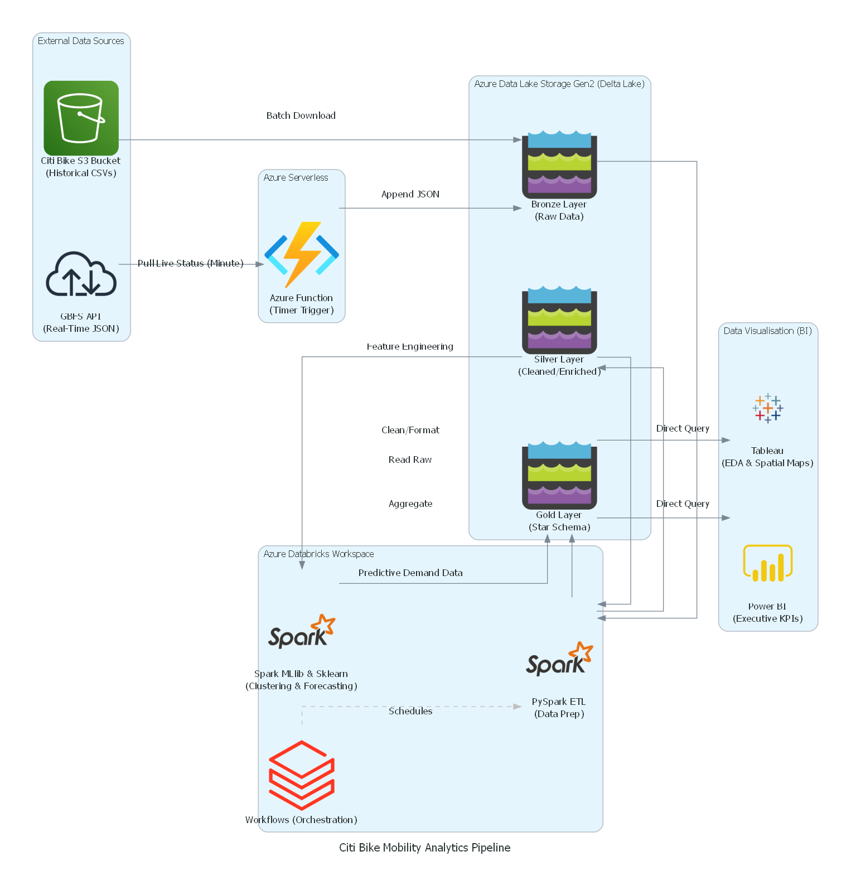

# Optimisation Logistique et Analyse Prédictive des Flux de Mobilité Citi Bike

**Auteur :** Mohamed Amine Bouali  
**Contexte :** Projet de file rouge Data Analyst (Simplon x JobInTech)

## 📌 Project Overview
The Citi Bike bike-sharing system faces a daily logistical challenge: severe station imbalance. During peak hours, certain stations deplete rapidly while others reach maximum capacity, preventing users from docking their bikes. 

This project aims to anticipate inventory imbalances and optimize redistribution strategies by building a robust data pipeline that cross-analyzes historical trip patterns with real-time station availability.

## 🏗️ Architecture & Technical Stack
This project leverages a modern cloud data architecture on **Azure** and **Databricks**, utilizing a Medallion architecture (Bronze, Silver, Gold) powered by **Delta Lake**.

*   **Real-time Ingestion:** **Azure Functions** (Serverless Python) triggered on a schedule to fetch live General Bikeshare Feed Specification (GBFS) JSON data.
*   **Batch Ingestion:** Automated fetching of historical "Citi Bike Trip Histories" CSV archives (millions of logs) from AWS S3.
*   **Data Lake Storage:** **Azure Data Lake Storage Gen2** combined with **Delta Lake** for ACID transactions, schema enforcement, and time travel.
*   **Processing & ETL:** **PySpark** running on **Databricks** clusters to clean, transform, and aggregate massive datasets into a structured Star Schema (Fact and Dimension tables).
*   **Orchestration:** **Databricks Workflows (Jobs)** to schedule and automate the pipeline.
*   **Machine Learning:** **Spark MLlib** (Clustering/K-Means) and **Scikit-Learn/TensorFlow** (Time-series forecasting) to identify behavioral zones and predict station demand.

## 📊 Key Performance Indicators (KPIs)
The transformed data feeds directly into our BI layer to track the following metrics:
1.  **Taux de Déséquilibre Logistique :** Ratio of departures to arrivals per station/time slot.
2.  **Taux d'Épuisement (Stock-out rate) :** Percentage of time critical stations are completely empty.
3.  **Indice de Rétention :** Proportion of daily trips made by annual subscribers.
4.  **Volume de Flux Inter-Quartiers :** Traffic volume connecting residential and commercial zones during peak hours.
5.  **Durée Moyenne de Trajet par Cohorte :** Journey duration comparison between subscribers and casual users.

## 📈 Data Visualisation
Two distinct BI tools are utilized for tailored data storytelling:
*   **Tableau:** Deep Exploratory Data Analysis (EDA), technical mapping of mobility flows, and visual exploration of Machine Learning clusters.
*   **Power BI:** Executive-level synthesized dashboards highlighting the 5 core KPIs for rapid management decision-making.

## 🚀 Setup & Execution (To Be Updated)
*Instructions on how to configure the Azure environment, set up the Databricks workspace, and run the PySpark notebooks will be added upon deployment.*
